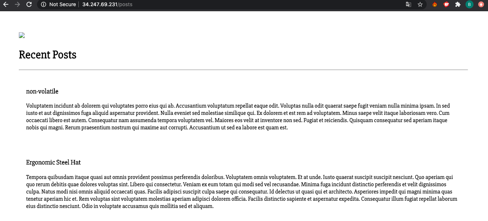

## Provisioning 2 AMIs (Amazon Machine Instance)
#### The Task: have /posts running successfully from app ami
#### Prerequisites:
- Create a new db ami (from the EC2 dashboard)
- Provision the new db ami
- Add app ami to the security group of db ami's inbound rule - this allows for bi-lateral communication between the two machines
- create environment variable in app AMI that establishes connection to mongodb

### ***for information regarding creating a new AMI [click here](https://github.com/Spartabariallali/Nodejs_Webapp_App/blob/master/README.md)***

---
***the following instructions require a db ami to have already been created***

## Setting up DB ami

[Files to download are accessible here](https://github.com/Spartabariallali/Nodejs_Webapp_App/tree/master/environment/db)


#### 1. Syncing files to db ami

The following command syncs files from your os to the db ami

```bash
scp -i ~/.ssh/"YourAws_key.pem" -r ~/Your_path_to_files ubuntu@Your_ami_Ip_address.eu-west-1.compute.amazonaws.com:/home/ubuntu/
```

***In my case***

```bash
 scp -i ~/.ssh/DevOpsStudents.pem -r ~/desktop/nginx_sample_code/nodejs-aws-deploy/environment/db ubuntu@ec2-54-76-170-201.eu-west-1.compute.amazonaws.com:/home/ubuntu/
```


- Verify that files have been properly synced by checking your db ami
```bash
ls
```
- This should be the following output:


- run the command:
```bash
./provision.sh
```
- To see if mongodb is successfully installed run the following command:

```bash
sudo systemctl status mongod
```

- If the you can see the following:


- db ami successfully provisioned

---

### Assigning security group privileges  

- Access your EC2 dashboard and locate your AMIs


- select your db AMI and click the security groups


- select edit inbound rules

- update inbound rules so that the app ami is able to access the db AMI's port 27017


- save and exit


---


### Creating environment variable in App AMI

- ssh into your app AMI
```bash
ssh -i ~/.ssh/"YOUR_AWS_KEY" ubuntu@Your_ami_Ip_address.eu-west-1.compute.amazonaws.com
```

- run the following command ensuring you include your db AMI's public ip address
```bash
export DB_HOST=mongodb://your_DB_ami_public_ip:27017/posts
```

- go to your app directory

- run the following command
```bash
npm install
```
 run your web app via the following command
 ```bash
 run node app.js
 ```
- access your webapp via your app AMI's public id
- http://your_app_ami_public_ip/posts


